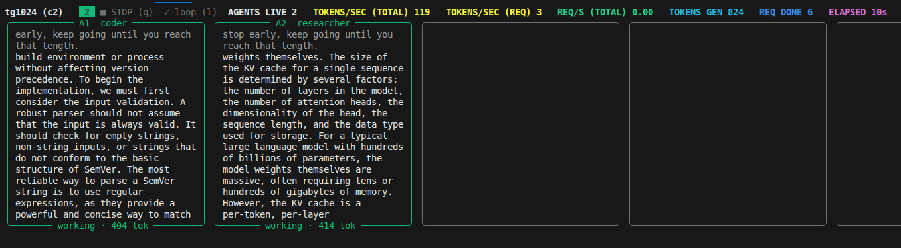
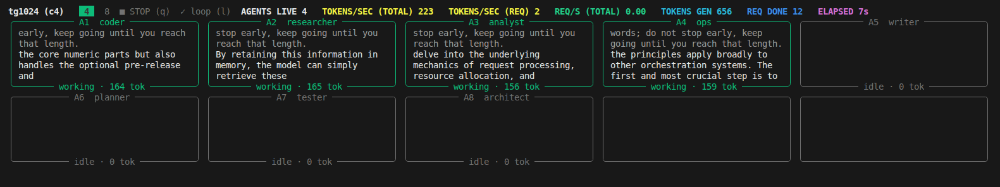

# chinchilla-llm-bench

Concurrency benchmark for a remote **vLLM** server, with a live **agent-swarm**
terminal UI: every concurrent request gets its own card showing what it is
doing (prompt, streaming output, token count) while the run is in progress.

Connections use the official **`openai` Python SDK** — any OpenAI-compatible
endpoint (vLLM, SGLang, TGI, …) works.



```
chinchilla-bench --base-url http://127.0.0.1:8000/v1 \
                 --model qwen3.8-27b-nvfp4 --pp 200 --tg 128 --c 1 2 3 4
```

## What it measures

For every concurrency level `c` in `--c`, two tests are run: each test is a
block of `c` concurrent agents, repeated `--n` times (llama-benchy
semantics: `--n` = repetitions, total requests = `n × c`). One repetition of
the c concurrent agents is a **wave** (batch), the unit of the aggregate
metrics.

| test | what it does |
|------|--------------|
| `pp<pp>` (prefill) | prompt of `pp` tokens, `max_tokens=1` → measures prompt-processing speed and time-to-first-token |
| `tg<tg>` (decode)  | role prompt, `max_tokens=tg`, and — by default — vLLM's `min_tokens=tg` + `ignore_eos` (llama-benchy's `exact_tg`) so generation runs to exactly `tg` tokens instead of stopping early at EOS (the prompt also asks for ≥ tg words as a fallback for servers without that support) |

### The signals (llama-benchy-style)

All token counts are **real tokens, never chunk events** — one SSE chunk can
carry several tokens:

1. The request sets vLLM's `return_token_ids` extension, so each streamed
   chunk carries the exact token IDs of the tokens it delivers. A chunk with
   N tokens contributes N timestamps, spread evenly across the gap since the
   previous token → an exact per-token timestamp series per request.
2. If the server doesn't support `return_token_ids`, the server's own
   `usage.completion_tokens` count is used and timestamps are interpolated
   over the chunk times (last resort: 1 token per chunk).
3. After the warm-up, network latency is measured as the mean RTT of 3
   `GET /models` probes (llama-benchy's `api` latency mode). `est_ppt` is
   `ttfr − latency`, i.e. the time the server actually spent on the prompt.

### Report columns

| column | meaning |
|--------|---------|
| `t/s (total)` | aggregate tokens/second **per wave**: pp = Σ prompt tokens / (last first-token − first start), tg = Σ decode tokens / (last token − first token) over the wave's c requests. For `c=1` this equals `t/s (req)` |
| `t/s (req)` | per-request tokens/second: pp = prompt tokens / est_ppt, tg = (N−1) / (last token − first token). Mean ± std over requests |
| `peak t/s` | max tokens in a **1 s sliding window** over the wave's merged per-token timestamps (tg only; pp is a single token per request, so there is nothing to peak) |
| `peak t/s (req)` | same, per request, mean ± std over requests (tg only) |
| `ttfr (ms)` | time to first response chunk, mean ± std (pp only) |
| `est_ppt (ms)` | estimated pure prompt-processing time = `ttfr − latency` (pp only) |
| `e2e_ttft (ms)` | end-to-end time to the first *generated token* as seen by the client (pp only) |

Prompt length is made exact using vLLM's native `POST /tokenize` endpoint when
available (falls back to a ~1.3 tok/word estimate if the endpoint is missing).

## The live UI

While running, the terminal shows a swarm grid — one card per agent:

- **border color** = status: green working · cyan done · red error · dim idle
- **title** = agent id + role (`A3  tester`)
- **subtitle** = status + tokens generated so far
- **body** = the agent's own prompt (grey) and the live streaming output
  (white). The output is flow-wrapped: line breaks generated by the model are
  ignored, so every token is rendered as continuous text and no line is ever
  cut off mid-sentence; the newest wrapped lines are always visible.
- **top bar** = current phase, active concurrency level, `AGENTS LIVE`,
  `TOKENS/SEC (TOTAL)` (aggregate stream rate, real tokens), `TOKENS/SEC (REQ)`
  (per-request generation rate), `REQ/S (TOTAL)` (request completions/s),
  `TOKENS GEN` (total tokens generated), `REQ DONE`, `ELAPSED`

Keys while running: `q` or `s` = stop (reports what finished), `l` = toggle loop.



Every agent works on a task that matches its role: the prefill prompt starts
with a role-specific instruction (coder refactors code, researcher summarizes
papers, …) and is padded to exactly `pp` tokens; the decode prompt is a short
role-specific instruction.

Reasoning is **disabled by default** (vLLM `chat_template_kwargs
{"enable_thinking": false}`), so Qwen3-style thinking models generate content
directly and the cards show the answer immediately. Use `--thinking` to bench
the thinking mode instead — reasoning tokens then stream dim-italic into the
cards and are included in the token counts.

## Setup (uv)

```bash
uv sync          # creates .venv and installs deps
uv run chinchilla-bench --help
```

## Usage

```bash
uv run chinchilla-bench \
  --base-url http://127.0.0.1:8000/v1 \
  --model qwen3.8-27b-nvfp4 \
  --pp 200 --tg 128 \
  --c 1 2 3 4
```

| flag | default | description |
|------|---------|-------------|
| `--base-url` | — | OpenAI-compatible base URL (required) |
| `--model` | — | served model name (required) |
| `--pp` | `200` | prompt tokens for the prefill test |
| `--tg` | `128` | tokens to generate for the decode test |
| `--c` | — | concurrency levels to sweep, e.g. `--c 1 2 3 4` (required) |
| `--n` | `5` | repetitions per test: each agent runs `n` times (total = `n × c` requests) |
| `--warmup` | `2` | throwaway requests before measuring, to wake a cold server |
| `--temperature` | `0.0` | sampling temperature |
| `--timeout` | `300` | per-request timeout (s) |
| `--seed` | `1337` | prompt-generation seed |
| `--thinking` | off | enable reasoning (Qwen3) thinking mode; off by default so content is generated directly |
| `--no-exact-tg` | off | let the model stop at EOS instead of forcing the full tg budget (`min_tokens` + `ignore_eos`; on by default) |
| `--api-key` | `dummy` | API key (vLLM accepts any non-empty string) |
| `--loop` | off | repeat the whole sweep until stopped |
| `--output` | `model_result_<model>.txt` | where to write the markdown report |
| `--no-ui` | off | plain progress lines instead of the swarm UI (good for logs/CI) |

The run ends with the settings summary and the results table printed to the
terminal, plus a markdown copy written to `model_result_<model>.txt`:

```
| model             |      test |   t/s (total) |    t/s (req) |  peak t/s | peak t/s (req) |      ttfr (ms) |    est_ppt (ms) |   e2e_ttft (ms) |
|:------------------|----------:|--------------:|-------------:|----------:|---------------:|---------------:|----------------:|----------------:|
| qwen3.8-27b-nvfp4 | pp200 (c1) | 4448.64 ± 1603.51 | 4448.64 ± 1603.51 |  |  | 144.27 ± 19.48 |  40.72 ± 19.48 | 144.27 ± 19.48 |
| qwen3.8-27b-nvfp4 | tg128 (c1) |     66.83 ± 5.13 |     66.83 ± 5.13 |  72.0 ± 4.1 |      68.0 ± 5.0 |                |                |                |
```

## Project layout

```
src/chinchilla_llm_bench/
├── cli.py      # argparse CLI + entry point
├── config.py   # BenchConfig (all settings)
├── client.py   # streaming client on the official openai SDK + /tokenize + latency probe
├── prompt.py   # builds prompts of ~pp tokens (exact via vLLM tokenizer)
├── agent.py    # one worker thread = one swarm card
├── ui.py       # rich Live swarm grid + top bar + key handling
├── runner.py   # sweep orchestration: preflight, warmup, latency probe, pp/tg phases
├── stats.py    # mean±std, live rate trackers, phase aggregation
└── report.py   # rich table (console) + markdown table (file)
docs/           # screenshots (docs/swarm.png)
tests/          # pytest suite with a mock vLLM server
```

## Tests

```bash
uv run pytest
```

The suite runs a real HTTP server (`tests/mock_server.py`) that speaks just
enough of the vLLM/OpenAI API (SSE streaming with per-chunk `token_ids`,
usage chunks, `/models`, `/tokenize`) to exercise the client, the full sweep,
and the report end to end.

## Notes

- Any OpenAI-compatible endpoint works (the client is the official `openai`
  SDK); `est_ppt`, exact prompt sizing and per-chunk token counts are best
  with vLLM (it serves `/tokenize` and `return_token_ids`). On servers without
  `return_token_ids` the client falls back to the server's usage counts.
- A warm-up runs before measuring so a cold server (first-request wake-up,
  CUDA graph builds) doesn't inflate `ttfr`/`est_ppt`; network latency is
  then probed (3× `GET /models`) and subtracted from `ttfr` for `est_ppt`.
- Reasoning is disabled by default; a thinking model with a 1-token budget
  would otherwise spend it on reasoning and the prefill test would measure
  nothing.
- `--n` is a repetition count, not a total: `--c 4 --n 3` runs 3 full waves
  of 4 concurrent agents (12 requests), exactly like llama-benchy.
- `exact_tg` is on by default: vLLM `min_tokens=tg` + `ignore_eos` forces the
  full budget. Disable with `--no-exact-tg` (the prompt then asks for ≥ tg
  words so EOS rarely hits before the budget).
- Results depend on server load; run the sweep twice to check stability.
